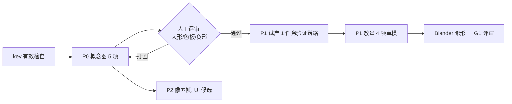

# AI 资产生成与规划 v1（ai-asset-pipeline 技能配套）

日期：2026-10-07。配套技能：`.agents/skills/ai-asset-pipeline/`。本文回答三个问题：**用什么生成**、**生成什么**、**按什么顺序**。

## 1. 生成能力盘点（已封装进技能）

| 能力 | 路线 | 状态 |
|---|---|---|
| 概念图/立绘/三视图/图标 | Nano Banana + 风格锚点（`timiai_client.py::gen_image_nano`） | 通道已验证（key 已重新启用） |
| 纯文生图兜底 | GPT-Image-2（`gen_image_gpt`） | 文档齐备 |
| 文字起稿 3D 草模 | Tripo text2model | 端点文档齐备，待首次真任务验证 |
| 本地图生 3D 草模 | Meshy image2model（base64 直传） | 端点文档齐备，待首次真任务验证 |
| 多视图生模 | Meshy multiview2model（front/left/back/right） | 端点文档齐备 |
| 像素帧全套 | `reclaimer_pixel_frames.py`（定妆锚+洋红底+归一化） | 策略源自稷下学院全套验证 |

风险边界：Tripo 模型 URL 5 分钟过期；Tripo 图生模只收 HTTP URL（本地图一律走 Meshy）；Meshy 精修需 preview 任务 SUCCEEDED；大量任务受平台积分/速率限制，批量前先小批量探路。

## 2. G1 缺口 → 生成任务映射

> **2026-10-07 路线升级**：接入腾讯内部 VISVISE Weaver 平台（ws.visvise.com.cn，凭证 `D:\工作\生图API\weaver\鉴权.txt`，rtx=jasonlyan）。实测配额模型 1000/动画 1000/图片处理 100，通道验证通过。Weaver 一个接口覆盖 图生高/中模+PBR、图生360 四视图、2D拆分单部件生模、重拓扑、LOD、UV/2UV、骨骼架设+智能蒙皮、视频/文本生动画，**P1 主路线切换为 Weaver**；Tripo/Meshy 降级为备份通道。配套客户端：`.agents/skills/weaver-asset-production/scripts/weaver_api_client.py`（标准库实现，已实测）。

## 3. G1 缺口 → 生成任务映射

按 [g1-quality-gap-report.md](../assets/g1-quality-gap-report.md) 的六项放行条件，AI 生成能直接贡献的是第 1、2、4 项的"候选输入"，其余（实机截图、HUD 样板、动作实装）仍走 Blender/Godot。

### 批次 P0：概念图补强（立即可跑，纯生图，不耗 3D 积分）

| 任务 | 产物 | 路线 | 服务于 |
|---|---|---|---|
| P0-1 A01 状态三连概念图 | 鲸口准备/咬合/余韵三态 | nano + 概念图 `A01-whale-jaw-reclaimer.png` 作锚 | G1 条款 1、2 |
| P0-2 B01 行为链概念图 | 预告→筑墙→横冲 | nano + `B01-reverse-crab.png` 作锚 | G1 条款 3 |
| P0-3 C04 三态概念图 | 停机/施工/恢复 | nano + `C04-repair-pump-cutaway.png` 作锚 | G1 条款 1 |
| P0-4 手绘表面图集候选 | 漆钢/橡胶/骨白/玻璃/混凝土材质块 | nano 纯文生图 + 六色板锁 | G1 条款 1（贴图绑定输入） |
| P0-5 河岸前中后景分层概念 | 背景/中景/近景三张 | nano + 风格锚点 | G1 条款 4 |

### 批次 P1：3D 草模候选（key 与积分确认后小批量试产）

| 任务 | 输入 | 路线 | 产出定位 |
|---|---|---|---|
| P1-1 A01 鲸口草模 | P0-1 概念图（去文字、单主体清理后） | meshy image2model，standard | 仅 api_candidate，供 Blender 修大形参考 |
| P1-2 B01 蟹草模 | B01 概念图 | meshy image2model | 同上 |
| P1-3 C04 泵草模 | C04 概念图 | meshy image2model | 同上 |
| P1-4 散件库种子 | 文字直接起稿（管道、浮标、锚块、桥段） | tripo text2model ×4，smart_low_poly | modular-fantasy-v1 部件库候选 |

试产规约：每批先跑 1 个任务端到端验证（提交→轮询→5分钟内下载→BLender 打开检查），成功后再放量；每个 task_id 记入 manifest。

### 批次 P2：像素帧（HUD/图标/UI 小图可用，主角色仍走 3D 链）

- 用 `reclaimer_pixel_frames.py` 出挖掘机 Q 版动作帧（idle/run/attack/hurt/die），产物只作 UI/文档/营销素材候选，不进 3D 主链。
- 六色板与工业童话风格锁已内置，定妆锚先人工确认再铺帧。

## 3. 执行顺序与门禁



门禁规则：
1. P0 概念图未经人工评审不进 P1；概念图只锁"形状语言+色板方向"，不作为贴图直贴。
2. P1 试产必须先单任务走通全链（含下载后 Blender 可开、面数记录）再放量。
3. 所有生成产物状态一律 `api_candidate`；进入 `review` 按资产合同 7 项；`integrated` 只在 Godot 实机验收后。
4. 风格漂移回滚：改 STYLE_LOCK 必须版本化（v2、v3），旧候选作废重排。

## 4. 与 Weaver 链的分工边界

- Weaver（已有技能）：四视图、重拓扑、UV、LOD、骨骼蒙皮——**结构化后处理链**。
- 本技能（Tripo/Meshy）：**草模候选来源**，快速探索大形；给 Weaver 提供输入或与 Weaver 图生模互为备份。
- 像素帧（本技能）：2D 专属，Weaver 不覆盖。
- 概念图（本技能）：所有 3D 链的统一输入源头。

## 5. Manifest 规范

每个资产目录 `artifacts/ai_candidates/<asset_id>/manifest.json`：

```json
{
  "asset_id": "A01",
  "tasks": [
    {"tool": "meshy", "endpoint": "image2model", "task_id": "...", 
     "input_sha256": "...", "output": "model/a01_draft.glb", "output_sha256": "...",
     "created": "2026-10-07", "status": "api_candidate"}
  ],
  "concept_refs": ["docs/assets/2d-candidates/A01-whale-jaw-reclaimer.png"],
  "style_lock_version": "reclaimer-v1"
}
```
