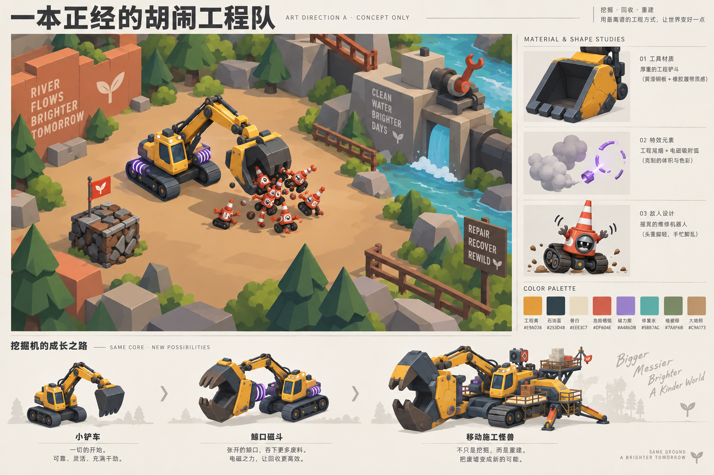

# 整体美术方向 A：一本正经的胡闹工程队

2026-09-21 · **待用户确认的美学提案**。对应 P-01/P-02。先确认本方向，再制作 G1 实机样板；当前不批准批量正式资产。需求与验收以 [spec v0.4](../spec.md) 和 [需求索引](../requirements.md) 为准。

## 1. 先定玩家感受与世界气质

一句话：**开着一台认真干活的小铲车，把世界越修越离谱，最后成为压倒性的移动施工怪兽。** 玩家可以耍聪明、整蛊敌人、制造意外的机械连锁；机器强大、动作可靠、世界值得被修好。

情绪顺序是“看懂它→想试它→做出荒唐但合理的结果→想再来一次→看见环境变好”。幽默主要来自尺度反差、机械身体语言和自己造成的局面。文案只补最后一拍，例如把巨量敌人打包后淡定盖“已分类”章；主线信息仍用清楚的普通语言。

世界是有生活痕迹的荒唐工业童话：认真履职的失控维修机器、尺寸不合理的市政设施、歪歪扭扭但可修复的河岸。暴力表达为铁皮、螺帽、弹簧和烟尘。玩家从破坏中回收，从回收中建设。主角的性格优先由挖臂、驾驶室、灯和姿态表现，避免每个物体都贴人脸、靠堆眼睛表达好笑。

## 2. 对参考的学习必须有证据

本轮直接查看了导出图像、材质字段及场景相机数据。根目录为 F:/WanderburgAssetRipperExport/ExportedProject。下面是局部样例，不能代表所有资源和最终运行画面；逐项路径/hash见 [视觉证据](../../evidence/reference_visual_study.json)，模块层级见 [结构证据](../../evidence/reference_asset_contract.json)。

| 证据ID / 已观察内容 | 能支持的认识 | 原创转译 |
|---|---|---|
| RV-01：vehicle colorpalette2.png 为离散色块；Castle_STONE_01 UV reserve / Castle_STONE_02 UV Reserve 材质分别在39/40行引用该纹理GUID | 导出中存在共享色板式着色资源；材质名带reserve，不能据此断言全部在最终场景使用 | 本作用一套有限的工程色板组织车体、敌人和环境，减少每件资产独立调色 |
| RV-02：FRIENDLY_01_NOLIGHT 的shader GUID解析到 FlatKit_Stylized Surface；材质有Cel主模式、Flatness、描边、阴影与独立颜色字段 | 风格化明暗和轮廓是有意配置的表达层，低面数不是风格的全部 | Godot先做可读的大面明暗与接触阴影，再比较局部描边样板；无需照搬Unity插件或参数 |
| RV-03：VEHICLE_T2_TANK.png 侧视图里驾驶建筑、轮组、前端工具构成大形；石木差异由色块/少量断面表达 | 这张展示图具有明确的主次形状和机械身份 | 保留小驾驶室作为成长锚点，把巨大工作头与侧模块做成主要辨识点；用原创金属/橡胶语言 |
| RV-04：Front Cannon.png 是大色块、强外轮廓、少量内部线的图标 | 该图标缩小时仍由形状表达功能 | 图标只保留工作头和一个识别符号，组合卡用动作箭头与标签补语义 |
| RV-05：Wanderburg_tf_SmokeAlpha_004.png 呈团簇烟尘遮罩；三份Mat_DestertDustCloud_Test材质有其引用 | 导出里存在可复用遮罩与变体材质；最终粒子数量/透明叠加尚未知 | 原创少量团块精灵配Godot生命周期/颜色，避免铺满屏幕的写实雾 |
| RV-06：主场景包含多个orthographic=1的Camera记录 | 正交投影用于该场景中的相机；未确认哪个记录是游玩主镜头和动态参数 | 本作继续斜俯视正交方案，用真实画面测试角度、大小和遮挡，不抄某个size数值 |
| RV-07：FrontCannon/BackDash/TopMortar的等级部件、发射点、持续与爆发反馈分层 | 可见结构、状态与反馈作为模块交付整体组织 | 每件模块同时交付剪影成长、动作状态、发射挂点、冷却及组合反馈 |

其中 RV-01/03/04/05 的图像外观是直接查看；“为什么有效”和本作转译是设计判断。材质字段存在不等于该分支在最终帧生效；尤其不能把 _CelNumSteps=3 当作全游戏严格三色渲染的证明。未做本轮参考游戏的动态录像分析，节奏、镜头运动、最终后处理、声音和可玩状态切换仍待观察。

官方商店也将其描述为极简移动城堡游戏，并用会逃跑的村庄、骑自行车的骑士等反常组合建立荒诞感；这是文案层面的补充依据，不是代码或运行视觉证据。[Wanderburg 官方商店](https://store.steampowered.com/app/3624140/Wanderburg/)，访问于2026-09-21。

## 3. 当前画面为何不能作为目标美术

已查看本工程 clean/built 实机截图。当前地面是近似均匀平板和网格，资源为色块、敌人为球体；车辆工作头与主车体的层级弱，镜头内缺少地标与疏密。大面积测试说明和按钮占用画面，磁环比机械结构更显眼。缺的是整体设计规则、正式资产和演出衔接。

因此替换顺序为：**构图与明暗 → 场景大形 → 车辆/敌人剪影 → 材质 → 动作 → VFX/声音 → HUD精修**。即使关闭粒子和界面，第一屏也必须先有可读的空间和主体。已有功能白模保留用于行为对照，不能因新卡面或加发光就将其标记为美术达标。

## 4. 从整体到局部的视觉约束

### 构图与镜头

- 斜俯视正交；G1以约50–60度俯角作比较起点，镜头数值通过实机选定。车体要露出侧面、工作头与关节，不能只见一片平顶。
- 初始车含工具在1080p画面中的宽度以约10–14%为起点，成长态约18–24%；这是镜头样板目标，随可读性调整，不能暗改攻击距离或碰撞。
- 战斗区中央保持大面积低频地表，树木、管道、废墙成组放在边缘。先用明暗区分地面、主体、危险，细节只服务导航/状态。
- 一个场面一个主视觉笑点。最大成长时仍能看清前方危险与退路；植被遮挡通过摆位、透明/隐藏策略解决，需回归瞄准与可见目标。

### 形状与成长

设计时按大形约70%、功能次形约25%、装饰约5%的注意力分配。玩家以宽稳底盘、厚铲口、醒目小驾驶室为共同身份；敌人以尖锥、倾斜重心、顶重下轻表现失控；修复后环境逐渐出现柔和曲线、舒展植被与流动。

成长要增加新的负形和关节关系：小铲斗→上下颚张开形成吞咽空间→侧结构展开成为移动施工平台。驾驶室与转轴保留，玩家能认出“这是我的那辆车”。图中最终形态为幻想上限参考，G1只生产基础与一个鲸口阶段。

### 色彩、材质与灯光

| 用途 | 起始色板 | 使用约束 |
|---|---|---|
| 玩家主色 | 工程黄 #E9AD38 / 石油蓝 #253D48 | 大黄板与暗底盘形成主体，不给所有环境也刷工程黄 |
| 中性与文字 | 骨白 #EEE3C7 | 说明/关节亮面，小范围提亮 |
| 危险 | 珊瑚红 #DF604E | 结合锯齿/楔形与节奏，不能仅靠颜色 |
| 磁能 / 修复水 | 淡紫 #A486DB / 水青 #58B7AC | 按状态局部出现，长期高亮会失去信息价值 |
| 环境 | 橄榄绿 #7A8F6B / 大地褐 #C9A173 | 降低局部对比，成片组织冷暖 |

材质家族限制为漆钢、暗橡胶、土石、植被、水/能量。先用色板/顶点色/共享材质和宽倒角建立质感，再加少量有意义的磨损。大面明暗控制在少数可读层次，暖主光与偏冷阴影分工；描边只在小尺寸轮廓确有收益时使用。参数由Godot Mobile实机样板决定，概念图上的高光不直接烘成贴图。

## 5. 喜剧必须可玩、可看、可听

| 喜剧场景提案 | F：规则结果 | P：观众读到的笑点 | 限制 |
|---|---|---|---|
| 鲸口打包（首个样板） | 聚拢合格小目标，有限装载压缩，一次投掷结算 | 吸入前履带拼命倒转；大颚合拢；方块留一根倔强小旗；释放后小旗最后落下 | 正式目标资格/伤害先验证；未实现，不能用动画伪装吞敌 |
| 强制洗车（后续） | 已有水→湿润→有限电弧链；任何新增滑行/失衡另立F | 敌机狼狈甩水、天线抖动、放电后短暂冒烟 | 电弧路径与实际目标一致，危险提示不被泡沫盖住 |
| 工地保龄球（后续） | 惯性冲击对合法目标产生明确位移/碰撞结果 | 路锥小兵依次失衡、最后一个迟半拍倒下 | 延迟倒下可为装饰；若改变可攻击状态就归F |
| 蛮力修泵 | 完成工程条件才恢复设施/水道 | 巨型扳手转动，泵咳两下才顺畅出水，下游一朵过大的花啪地打开 | 启动演出不延迟权威任务到账；花为表现 |

每个动作有准备、接触、余韵三拍。主角接触要干脆，余韵可以有弹性和迟半拍；音效以扎实机械低中频接触配短促滑稽尾音，重复动作准备3–5个小变体。主攻击反馈优先于杂兵笑声，玩家可减少重复语音、震动与闪光。喜剧强度随能力成长升级，不能每次开火都强制停顿播梗。

验收看玩家是否理解自己做了什么、愿不愿再做或变着做；不能用“每分钟必须笑几次”代替体验。试玩时记录自发描述/复现/换构筑，另问是否烦躁或被遮挡。

## 6. 界面也服从同一世界

HUD采用简洁工单/检修铭牌语法：保留耐久、载荷/热量、当前目标、关键动作，其他调试信息进GM。无模态面板时以不透明UI覆盖面积低于约18%为样板目标；安全区与字体可缩放。全屏升级界面另做布局，不受此面积限制。

模块卡统一“工作头剪影→动作动词→组合条件→收益/代价→实车预览”。用户看的是同一辆车的变化；概念插画作为辅助。大段操作说明只在教学必要时出现。GM清楚标注开发状态，测试按钮不混入正式HUD身份。

## 7. 制作与确认

Image2.5目标路线负责风格探索和指定用途的位图；Blender/程序几何负责原创可旋转结构；Godot负责材质、灯光、程序机械动画、粒子、电弧、水纹、镜头、UI与声音。具体状态/挂点/alpha/导出合同沿用 [资产制作规范](production-guide.md)。

当前方向板以内置 imagegen 生成：v1检视后发现地表和磨损细节偏密，v2作单项简化修订。**实际模型版本未公开，不能宣称已核实使用image2.5。** [首轮提示词](art-direction-prompt.txt)、[修订提示词](art-direction-revision-prompt.txt)、[生成记录](art-direction-manifest.json) 均保留。

v2用于确认调性、形状密度、色彩和成长感觉。图中的英文标语、侧栏小字与比例不直接作为游戏资产；正式文字由可本地化UI绘制。它也没有证明实时阴影、性能、装配或碰撞正确。

确认后做G1实机样板，提交六组同相机证据：基础/成长、无VFX/战斗VFX、污染/修复；附720p和1080p检查、构筑和GM条件，再提交一段连续动作短片。美术方向发生实质变化时回到这张板更新，不让每个模块各自长出一种风格。
