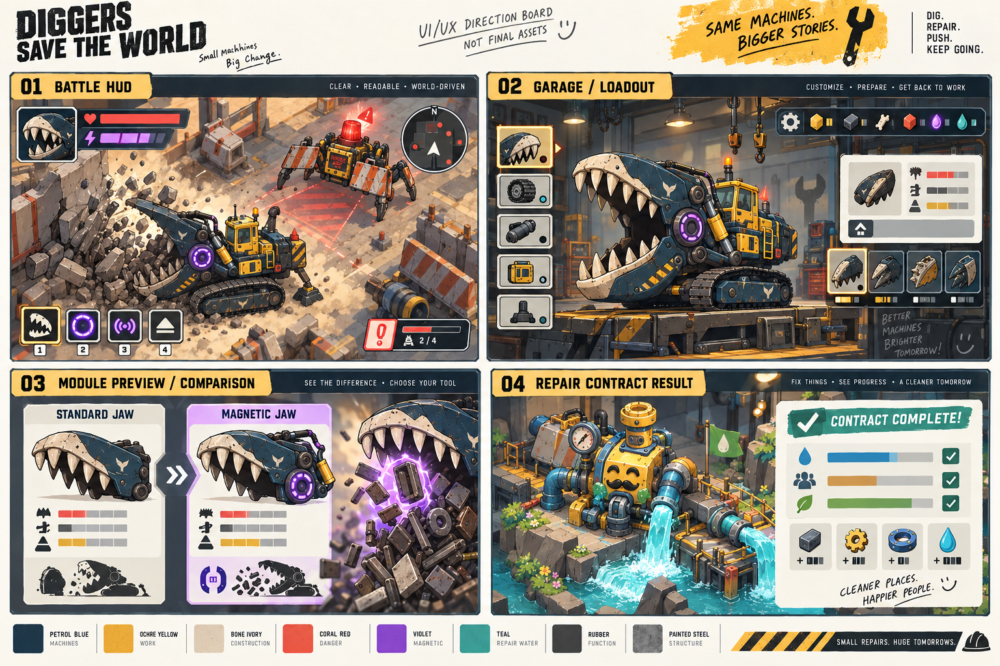

# G0 UIUX 与 3D 重做 brief：图形漫画方向 C

日期：2026-09-28。状态：图形漫画方向 C 已由用户确认，本文进入首轮生产交接。本文是设计入口和质量门，不把概念 PNG 或 3D candidate 直接批准为正式游戏集成。已确认的概念图是视觉真源，正式模型、贴图、灯光、动作和 UI 必须从概念图重新还原。

## 当前结论

这张方向板以 A01/B01/C04 概念图为参考，展示 HUD、装配、模块比较和修复结算的目标信息层级与渲染密度。它是设计讨论用提案，不是可直接进入游戏的 UI 或贴图；本轮新增的首轮磁暴流派、敌人和 Boss 必须遵循同一图形漫画语言。

本 brief 同时服从项目全局指导：正式内容必须风格化、高精度、去 AI 感；构筑规划至少 100 个可区分 build，每个 build 都要有机制签名和对应视觉表现。

- 当前 Godot 界面、HUD、装配面板、结果面板和反馈动效全部视为白模。
- 当前程序化车体、鲸口 GLB、B01/C04 作者化 GLB、Weaver 候选和现有转台图全部视为白模、3D candidate 或研究样件。
- 概念图优先级高于当前白模：A01、B01、C04 的正交/俯视/动作/材质/状态面板是建模、贴图和 UI 还原依据。
- A01 磁暴鲸口、B01 施工蟹、C04 修复泵、倒流河谷是玩法样板目标；图形漫画方向 C 已批准为生产方向，但它们仍不等于已集成的正式资源。
- 允许开始首轮概念 PNG 和 3D candidate 生成；在真实 Godot 镜头、碰撞、动作、LOD、UI 避让和缺陷复测通过前，禁止称为 `integrated` 或“最终美术”。

## 已确认的视觉与内容合同

- **方向 C：图形漫画机械剧场**。以强轮廓、硬色块、夸张透视、非对称结构、作者化材质笔触和漫画式速度/打击形状建立识别度。画面必须复杂、精准、有意图，不能简化成低多边形、统一工业玩具或随机 AI 细节。
- **首轮流派**：约 15 分钟，磁暴鲸口从小型作业体成长为移动回收工厂，再成长为超大型吞噬机械；镜头随形态动态拉远，但保留目标、危险区和退路。
- **敌人梯度**：N01 路障蟹、N02 刀轮废料犬、N03 炮虫、N04 维修蜂；E01 雷炉河马、E02 浮环猎手；BOSS01 断城巨神。普通敌人负责节奏，精英负责反制，Boss 通过三阶段战斗被击败。
- **战斗目标**：高速清怪、重击、物理连锁和 boss 战斗爽感优先；修复是战后结果，不替代 BOSS01 的击败条件。

## 资产状态三分法

| 状态 | 可以证明 | 不能证明 |
|---|---|---|
| 概念 PNG | 造型、剪影、色材、动作意图、敌人职责、Boss 阶段 | 不能证明可旋转模型、碰撞或实机帧率 |
| 3D candidate | 模型/材质/骨骼/动作候选可被导入和评审 | 不能证明真实镜头可读、性能或正式玩法集成 |
| 真实游戏集成 | Godot 实际镜头中的碰撞、动作事件、材质状态、LOD、UI 避让、波次和缺陷证据 | 仍需完整发布验收才能称 `final` |

## 必须保留的玩法约束

- 装配 → 预览 → 确认 → 实战组合 → 升级/变形 → 存档恢复流程不变。
- 模块必须改变操作、剪影、路线、节奏或修复关系，不能只增加 DPS。
- 玩法权威状态、碰撞、命中、资源、修复和存档不由模型动画或 UI 表现决定。
- 准备 → 接触 → 余韵三拍仍是动作和喜剧反馈的最低合同。

## G0→G1 当前交付

1. 一张图形漫画整体调性板：玩家三阶段、N/E/Boss 梯度、设施、场景、材质、光线、色板、速度/打击形状和幽默比例。
2. 一套 UIUX 流程稿：战场 HUD、装配/预览/确认、动态镜头拉远时的信息避让、暂停/设置、结算/恢复；标出信息优先级和手柄焦点路径。
3. 一套三视图与战斗镜头稿：磁暴鲸口三阶段、N01–N04、E01–E02、BOSS01；明确主负形、危险方向、弱点、退路和模块接口。
4. 一张无 VFX 的 Godot 真实镜头样板图，以及首轮波次/ Boss 阶段和 UI 避让检查。
5. 一份反例清单：白模感、通用工业玩具、细节噪声、AI 融合结构、不可读 HUD、遮挡退路、装饰改变碰撞等。
6. 一份概念 PNG→3D candidate→真实游戏集成的清单和状态标记，确保“开始生成”不会被误报为“已经完成”。

## 概念图真源

| 资产 | 视觉真源 | 必须还原的内容 |
|---|---|---|
| A01 磁暴鲸口 | `2d-candidates/A01-whale-jaw-reclaimer.png` | 深石油蓝车体、赭黄驾驶室、骨白鲸牙、紫色磁环、履带层级、三阶段剪影、模块接口和吞吐动作 |
| B01 施工蟹 | `2d-candidates/B01-reverse-crab.png` | 橙白路障板、反向警示灯、液压腿、横向冲刺姿态、红色扇形预告、推墙/拆锚两种反制 |
| C04 修复泵 | `2d-candidates/C04-repair-pump-cutaway.png` | 黄蓝泵体、压力表、阀轮、密封环、管口、停机/施工/恢复三态、桥和水流前后变化 |

首轮新增敌人和首领概念图沿用同一来源约束：N01–N04、E01–E02、BOSS01 必须先有可读剪影、危险预告、弱点/反制和阶段动作，再进入 3D candidate。Boss 的城墙式肩架、断裂施工臂和核心弱点是主识别点，不能被随机机械细节淹没。

概念图中的文字只作为设计标注，不直接烘焙进模型贴图；需要在游戏中出现的文字由 Godot UI 本地化渲染。

## 通过条件

- 缩到 128px 仍能读出玩家车、敌人和设施的主行为剪影。
- 关闭 VFX、贴图和声音后，玩家仍能指出目标、危险、工程解法和可走退路。
- UI 不遮住工作区、目标、退路或关键预告；键鼠和手柄焦点顺序都可说明。
- 模块预览能同时表达安装前后轮廓、动作变化、收益、代价和组合关系。
- 图形漫画方向已经确认；概念 PNG 标记为 `proposal`/`source`，3D 输出标记为 `candidate`，只有真实 Godot 镜头、碰撞、动作、LOD、UI 避让和缺陷复测通过后才使用 `integrated` / `final`。

## 当前待验证

- 首轮波次数量、敌人伤害、Boss 阶段时长和镜头拉远阈值；文档值是试制起点。
- UI 信息密度在高速混战和 Boss 阶段的可读性，以及动态拉远后的安全区。
- 概念 PNG 与 3D candidate 在真实 Godot Mobile 镜头中的材质、碰撞、LOD 和性能缺陷。
