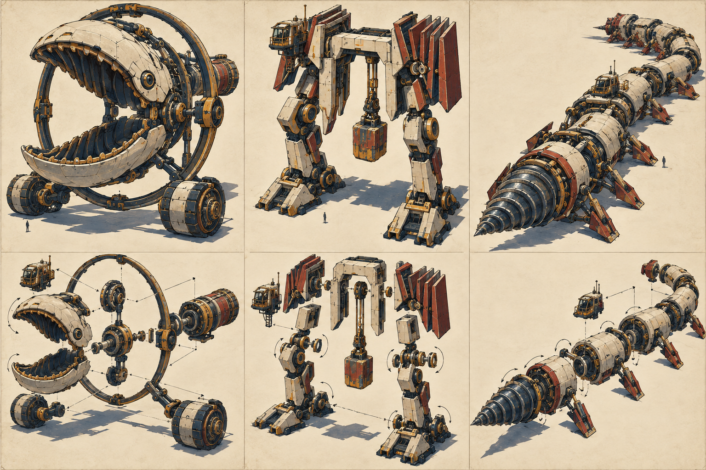

# Modular fantasy samples v1

这批样件按“核心件 + 升级 1 + 升级 2 + 升级 3”制作。它们验证的是可拆部件、连接点、功能链和视觉成长，不是已经接入 Godot 的最终资源。

| 样件 | 核心形态 | 升级 1 | 升级 2 | 升级 3 |
|---|---|---|---|---|
| `hoop_leviathan` | 双颚 + 双驱动轮 + 偏置驾驶舱 | 磁悬环 | 尾部压缩机 | 侧向抗后坐支架 |
| `origami_gate_titan` | 门形承重架 + 双足 | 折叠护翼 | 配重翼 | 摆锤重击 + 蓄压背包 |
| `screw_worm` | 三节螺旋钻虫 + 驾驶舱 | 中段万向节 | 增加节段与驱动鳍 | 尾部锚冠 |

每个样件都包含：

- 独立网格和命名枢轴；
- 拆下后的功能后果和动力来源；
- `idle`、`attack`、`deploy`、`exploded` 动作片段；
- 隐藏碰撞代理；
- 统一米制、UV、材质分区和 Blender 源文件；
- 阶段 1/2/3 渲染与组装/爆炸图。

Blender 5.2.2 结构检查结果见本机 `artifacts/qa/weaver/modular-fantasy-validation.json`。它们仍需 Godot 真镜头、碰撞、LOD、性能和战斗事件验收。
