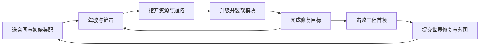

# 《挖掘机拯救世界》游戏设计基线

版本：2026-09-20 · 状态：立项与原型用提案，数值尚未通过试玩验证。

制作前提：个人主导、AI 协作、必要美术与音频外包；Windows / Steam 单机；Godot；3D 俯视低多边形。设计优先级已明确为 **战斗爽感 → 挖掘升级 → 世界修复**。以下数量是正式版内容上限，先用垂直切片验证，再决定是否全部制作。

## 1. 核心决定

一句话：**开着不断长大的挖掘机，把失控机器铲成零件，把零件装成新能力，再把战场挖回一片绿洲。**

类型是俯视角载具动作 Roguelite，以 12–18 分钟的独立合同串成有结局的修复战役。第一关 8–10 分钟，终局约 20–25 分钟。车辆同时承担移动、手动铲击、挖掘、投掷和自动副工具；修复区域给战斗提供补给与路线优势，也留下局外可见的世界变化。

首发目标：3 个群系、9 个区域合同、1 个终局，3 种共享结构的底盘、6 种作业副工具、8 种辅助模块、36 个升级定义、8 种普通敌人、3 个区域首领及 1 个组合终局。预期初次通关 4–6 小时，收集与挑战约 8–15 小时；这是根据合同长度、剧情与重试做的设计假设，不能当成已验证的宣传时长。

范围边界：固定视角、固定插槽、有限场景破坏、预制地图块重组；首发不做联机、任意自由拼车、地下洞穴、真实土壤/水流模拟、开放世界、基地经营、多人角色养成与持续运营赛季。这里的“挖掘”要有铲开通路与成片清障的快感，但每铲不运行土壤颗粒仿真。

## 2. 参考作品：已核实事实与本作判断

以下事实取自官方 Steam 页，查阅于 2026-09-20。商店描述能证明设计定位，不能证明内部代码架构、留存或商业成功原因。Wanderburg 本地安装目录是 Unity IL2CPP 发布包，不能把本提案称为其源码复刻。

| 作品 | 官方页面可核实的设计 | 本作借鉴判断 |
|---|---|---|
| [Wanderburg](https://store.steampowered.com/app/3624140/Wanderburg/) | 驾驶移动城堡，吞噬较小目标使城堡扩张，装载攻城模块，局外解锁模块、载具及船长 | 学习“吃掉环境→明显长大→改变装配”的反馈链；用施工动作和修复目标建立本作身份 |
| [Dome Keeper](https://store.steampowered.com/app/1637320/Dome_Keeper/?l=english) | 在攻击间隙挖掘资源，返回防守并升级设备 | 挖掘需要战术机会成本；本作把采集与战斗放在同一驾驶场景，避免往返割裂 |
| [Wall World](https://store.steampowered.com/app/2187290/Wall_World/?l=english) | 驾驶移动机器基地，探索矿洞、取得资源与科技，应对敌群 | 让移动平台形成可靠的玩家归属；保留“下一片区域有什么”的期待，不做独立下车采矿模式 |
| [Terra Nil](https://store.steampowered.com/app/1593030/_/?l=english) | 净化荒地、水域并重建生态，最后撤离 | 把世界前后变化当作关卡奖励；本作通过战斗目标直接触发修复，不加入完整生态平衡经营 |
| [Driveloop: Survivors](https://store.steampowered.com/app/3183730/Driveloop/?l=english) | 3D 载具战斗、漂移撞击、装备与乘员升级 | 驾驶路线本身应有战术价值；挖掘机主打抓地、旋转上车体和铲击重量，不能只像换皮赛车 |

本作差异应能在 10 秒视频里看见：铲起一群小机器，甩向装甲目标；巨型挖斗从垃圾坝中切出通道，干涸河床变蓝、绿意铺开；新副工具实际装到车身上，轮廓随阶段变大。

## 3. 三条体验支柱

| 支柱 | 玩家应该感到什么 | 制作与验收要求 |
|---|---|---|
| 重型工具、轻松操作 | 我开的是有重量的挖掘机，但它听话 | 起步、转向和铲击有质量感；按键到反馈立即可见；键鼠与手柄都能稳定命中近身目标 |
| 每次出车长出一种打法 | 开局的小车能在一局内变成工程怪兽 | 60–90 秒内首次选择；至少 2 次明显轮廓变化；每条代表流派改变操作或路线，而非只改 DPS |
| 我的破坏有建设意义 | 我打赢后真的救回了一块世界 | 每个主要目标都有局部即时修复；胜利提交到世界地图；结算展示同机位前后对比 |

**模块组合是第一设计支柱的放大器。** 本作不把模块理解成“数值卡牌”，而把它们做成能改变动作、路线、驾驶节奏、车辆轮廓和修复方式的幻想机械。AssetRipper 对参考包的导出也验证了这种方向：模块 Prefab 内同时存在主动/被动实例化点、冷却层、T0–T5 升级层级、安装反馈和不同槽位资格。完整规则见 [模块组合与幻想载具设计](module-combinatorics.md)。

## 4. 三层循环与完整会话

- **5–15 秒：** 寻找铲击角度 → 铲碎/铲起目标 → 拾取废料 → 投掷或冲出包围 → 下一个资源簇。一次有效铲击至少给出动作、接触特效、声音和目标状态变化。
- **12–18 分钟：** 选择路线 → 取得升级 → 清障并修复 2 个前置节点 → 车体进入第三阶段 → 区域首领 → 收尾修复与撤离。主线不要求扫清每一个小敌人。
- **整场战役：** 打通区域合同 → 获得确定的蓝图解锁 → 在世界地图看见文明与生态回归 → 进入下一地区 → 解决总控核心。结局后可自由重玩挑战，不新增强制刷取门槛。

完整产品流程：启动与无障碍设置 → 主菜单/存档槽 → 首次教程合同 → 车库与区域地图 → 出车装配 → 合同 → 成败结算 → 世界状态更新 → 下一合同 → 终局与片尾 → 挑战重玩。暂停、设置、退出与续玩贯穿其中。

## 5. 操控与挖掘规则

### 驾驶与镜头

固定俯视三分之四镜头，随车平滑跟随；常规战斗不旋转镜头。底盘和上车体独立：底盘负责前进，驾驶室与挖臂朝指向旋转。默认按屏幕方向驾驶，控制器将方向转换为有最大转速与加速度的载具运动；坦克操作仅在原型验证后作为可选项。

| 意图 | 键鼠初稿 | 手柄初稿 |
|---|---|---|
| 驾驶 | WASD | 左摇杆 |
| 瞄准挖臂 | 鼠标指向 | 右摇杆，松开后保留朝向 |
| 铲击/连续挖掘 | 左键按住 | RT |
| 投掷已装载块料 | 右键 | LT |
| 短时液压冲刺 | 空格 | LB |
| 目标交互/确认 | E | A |
| 暂停 | Esc | Menu |

副工具自动攻击，辅助模块自动触发；HUD 不再加四个主动技能按钮。所有输入可重绑定，提供按住/切换挖掘、辅助瞄准、镜头震动强度和受击闪光设置。所有 UI 有手柄焦点。

### 主挖斗必须保留存在感

主挖斗永远存在；6 种可选作业工具是副工具，不替换掉挖掘机的核心动作。主挖斗有两个结果：小目标/碎料可被铲入料斗，大目标受到伤害和失衡。投掷将料斗中的块料聚合成一发抛射，不模拟几十个实时物理弹体；空料斗仍可正常铲击。物料以有限种类/数量记录，视觉用少量代表碎块。

挖掘区域用浅层格子或可破坏预制块表达，每格有硬度、剩余耐久、资源量、清理后状态与稳定 ID。挖臂动作由程序动画/IK 对准命中点，实际范围判定与伤害由玩法系统决定。铲开块体后替换浅坑/清理地面，短寿命碎屑只作表现。

资源层分为松散废料、压实障碍和硬质矿块；硬度改变采集效率，不能让关键任务因随机没抽到工具而无法完成。所有必经路径可用默认挖斗打通；高硬度节点只提供支路、捷径与额外收益。修复后的草地无采集收益，也不会被玩家再次铲成污染地。

## 6. 第一场 15 分钟体验脚本

时间是体验目标，不是强制倒计时；第一合同在约 8–10 分钟完成，其余时间用于结算和第二次出车。

| 时间 | 发生什么 | 传达的信息 |
|---|---|---|
| 0:00–0:30 | 电台只说“先把出路铲开”；玩家从被掩埋的车库开出来 | 立刻可动，挖斗就是工具和武器 |
| 0:30–1:15 | 三组松散废料、一只缓慢维修爬虫；一次宽容铲击清掉一整簇 | 接触反馈、拾取与升级有因果 |
| 1:15–2:00 | 第一次三选一：宽斗 / 更快液压 / 废料投掷；保证三者都立即可用 | 选择打法，不考验术语 |
| 2:00–3:30 | 铲开水泵入口并启动；一小片土地变绿，同时提供一次维修 | 修复直接帮助战斗 |
| 3:30–5:30 | 解锁体量阶段 II 与首个副工具槽；出现冲锋敌人，提示侧向移动 | 车确实变大，路线开始重要 |
| 5:30–7:00 | 清理垃圾坝；可选小支路有蓝图箱；水流只做受控动画 | 玩家决定冒险程度 |
| 7:00–9:00 | 教学压路机小首领：前方危险、侧后方可铲，冲锋后露出核心 | 用已有动作考试，避免新按键 |
| 9:00–10:00 | 整片河岸复绿，电台响起鸟声，世界地图点亮第一格 | 给玩家充分看见结果的时间 |
| 10:00–12:00 | 结算解释本局装配、死因/贡献与新蓝图；车库装第二种方案 | 能理解自己变强的路径 |
| 12:00–15:00 | 玩家自愿开始第二合同，第一次使用不同副工具 | 验证“再来一局”而不是强迫教程 |

## 7. 载具、模块与成长

### 底盘与槽位

三种底盘共用移动代码、挖臂骨架与插槽：均衡履带、轻型宽轮、重装履带。差别控制在速度/转向、耐久、冲刺与初始被动，不产生三套内容管线。初始均衡底盘可完成全战役。

每辆车：固定主挖斗 + 1 作业副工具槽 + 2 辅助模块槽。阶段 I 有主斗与一个起始辅助槽；第一个主要修复目标开启阶段 II 和作业槽；第二个主要目标开启阶段 III 和第二辅助槽。阶段切换必定发生，不依赖稀有掉落。正式版每个底盘只做 3 个预定义成长装配态，不做运行时任意积木结构。

### 6 种作业副工具

| 工具 | 战斗/挖掘作用 | 代价或取舍 | 原型优先级 |
|---|---|---|---|
| 液压破碎锤 | 前向重击，破甲与硬块效率高 | 攻击窄，需要朝向 | P0 |
| 电磁回收盘 | 近范围拉扯轻敌与废料，帮助铲击成群命中 | 对重装目标拉力小 | P0 |
| 螺旋钻 | 穿透直线敌群，钻开长条障碍 | 身侧保护弱 | P1 |
| 高压水炮 | 持续推退、冷却与去除污染附着 | 直接伤害低 | P1 |
| 碎料发射器 | 把回收动作转成远程散射弹 | 依赖持续挖掘补充效率 | P1 |
| 电弧焊接器 | 近中距连锁放电，对已湿润目标联动 | 单体重甲效率低 | P2 |

### 8 种辅助模块

| 模块 | 主要效果 | 玩法职责 |
|---|---|---|
| 扩容料斗 | 增加装料上限与投掷体积 | 投掷流 |
| 加压液压泵 | 短时连续铲击/冲刺后加速 | 近战节奏 |
| 惯性飞轮 | 持续行驶蓄力，下一次铲击释放 | 驾驶与攻击联动 |
| 散热器 | 更快消退热量，延长工具有效作业 | 高输出稳定性 |
| 反应装甲 | 定期抵挡一次重击，触发小范围击退 | 容错 |
| 维修无人机 | 完成修复节点后恢复额外耐久 | 目标驱动生存 |
| 探测雷达 | 提前显示资源簇/支路，提升目标发现效率 | 路线选择 |
| 应急蓄电池 | 修复目标后强化冲刺并刷新一次工具爆发 | 工程目标与战斗联动 |

### 升级内容上限与抽选规则

36 个定义：12 个通用升级 + 12 个工具专属升级（每工具 2 个）+ 8 个辅助模块强化 + 4 个组合改造。一般升级可设 1–3 级；升级等级不是新资产数量。6 种工具与8种模块本体另记为装配定义。

12 个通用定义：铲击威力、铲幅、液压周期、挖臂长度、料斗利用率、投掷爆破、履带抓地、驱动加速、装甲厚度、散热效率、回收范围、修复效率。优先用带上限的加法或乘区管理，避免大量互乘导致后期数值失控。

每次升级三选一，至少一项与已装配内容或当前主斗有关；前两次选择不能出现无即时收益的组合终点。局内提供 2 次免费重抽与一个稳定的通用保底。没有槽位时不出现无法安装的工具；重复选择必须能解释其增量。

四个组合改造示例：磁吸 + 宽斗形成“打包压缩”；破碎锤 + 冲刺形成“冲击波”；水炮 + 电弧形成“导电洪流”；料斗 + 发射器形成“废料风暴”。组合是可预览的定向目标，满足条件后保证进入下一次专属选择，不把完整流派全押在随机上。

三条必须在垂直切片证明成立的流派：近身冲铲、聚怪投掷、边挖边射。每条都必须能完成主线、对付首领与修复节点，区别体现在最佳路线和风险，而不是一条有用、另一条只供展示。

## 8. 经济、局内外边界与失败

| 数值/资源 | 来源与用途 | 局外是否保留 |
|---|---|---|
| 回收废料 | 挖掘和击败机器取得，累计成局内经验并触发升级 | 否；没有搬回车库的库存管理 |
| 块料载荷 | 铲击暂存，用于投掷，和经验奖励分开记账 | 否 |
| 耐久/热量 | 伤害与工具作业改变；修复节点、补给与停火冷却恢复 | 否 |
| 蓝图 | 主线首通与指定挑战确定奖励，解锁工具/底盘选项 | 是 |
| 研究点 | 合同首次目标与结算奖励，用于购买已经发现的横向选项 | 是 |
| 世界修复状态 | 合同胜利提交，改变区域地图与相应地块展示 | 是 |

局外优先扩展选项，不依靠永久伤害倍率让前几小时故意难受。主线奖励足以解锁至少一种可行新方案；任何关键剧情能力都有确定来源。失败给已完成小目标的少量研究点，但不能比正常完成更高效；重复自杀和挂机刷取不应成为最优路径。

进入合同后保持同一装配和局内升级直到胜负。失败重置本次临时成长，不影响既有已修复地区和已解锁蓝图；本次世界修复只在胜利时提交，避免世界显示已修好、主线却要求重做。成功地区的困难重玩以“演练合同”表达，不把世界重新污染。片尾后的自由欣赏无需战斗。

保存采用合同安全检查点：目标完成、阶段转换或暂停请求后进入可序列化安全点，记录种子、装配、升级、资源、目标及地块状态；恢复时重建动态战斗对象，不承诺逐帧保存抛射物/碎屑。UI 清楚显示最近保存点。具体协议以技术架构文档为准。

## 9. 世界、剧情与合同目录

世界观：旧世界的自动建设系统失去维护，把“持续施工”当成最高指令，废料堆满河道，工厂吞掉农田。玩家驾驶最后一台能够自主选择任务的工程车，帮助仍在广播的人们恢复水、电与通路。对手以失控机器为主；人类使用电台与小幅头像，减少人物动画和过场成本。

叙事用 3 名电台角色：实干的维修师、记录生态恢复的观察员、仍遵循旧指令但逐渐改变的调度 AI。每关出发一句、过程最多两次短讯、胜利一段。情绪从孤独、热闹到重新连接；不采用全语音长对话，也不把阅读塞在激烈战斗中。

| 区域/合同 | 场景与修复目标 | 本关教学/变化 | 完成后的持续变化 |
|---|---|---|---|
| 河谷 1：第一滴水 | 废料围住的小河岸；清水泵、挖坝 | 操作、首次升级、基础冲锋敌人 | 第一条河流变蓝 |
| 河谷 2：让道路再通一次 | 废车与堵塞的通路；打通两条路线 | 路线取舍、物料投掷、保护薄弱节点 | 交通灯与远处小车重新出现 |
| 河谷 3：巨型压路机 | 区域首领及堤坝恢复 | 第一场完整首领战 | 聚落点亮，解锁盐海 |
| 盐海 1：醒来的风车 | 干涸盐地与被埋风机；清障复电 | 侧风预警、长射程敌人 | 风机转动，夜间灯带出现 |
| 盐海 2：清洗输水线 | 油污厂区；关闭污染源并连接设施 | 污染地面、净化后安全路线 | 湿地与鸟群回归 |
| 盐海 3：履带炼油厂 | 会排放危险区域的移动首领 | 引导走位、分阶段破甲 | 工业废墟成为湖岸 |
| 山城 1：信号穿过废墟 | 山城边缘；开辟台阶道路、恢复通讯 | 窄路和装甲敌人组合 | 全地区无线电重新连通 |
| 山城 2：给城市一口气 | 城市通风口与被封电站 | 混合群攻、限时支路 | 空气变清，建筑窗户点亮 |
| 山城 3：山岳采掘机 | 大型采掘首领、多方向挖臂 | 多阶段综合检验 | 中央核心坐标出现 |
| 终局：最后一项工程 | 复用三地区模块的总控工地 | 轮流恢复三个系统、应对重组攻击 | 全图修复与可驾驶欣赏结局 |

合同使用同一套地图块、资源与目标系统变化布置，不等于 10 张完全独立大地图。区域首领合同比常规合同多一个首领阶段，其前置目标仍控制在两个。终局复用已学过的攻击基元，并新增一个明确的最终互动，不再要求突然掌握另一种游戏。

任务语法限制为 4 类：清障打开通路、解除/修复节点、击败目标、在短时间内守住正在启动的设施。标准合同组合 2 个主要目标、0–2 个可选支路、1 个收尾。没有护送脆弱 NPC、长时间跑图交货和散落几十项收集物。

## 10. 战斗角色、压力与首领

8 种普通敌人围绕行为设计：蜂拥维修爬虫、直线冲撞车、远程钉枪塔车、侧翼绕行轮、正面盾板车、范围污染喷罐、修理友军的焊工机、召唤小机器的工厂车。前四种构成原型；后四种是同状态机的组合变化。精英通过已有基元组合与清晰标记实现，不为每个词缀新增模型。

首领共用“预告 → 行动 → 暴露弱点 → 恢复”的状态框架。压路机教躲冲锋后侧击；炼油厂教清理危险区与打断排放；采掘机教识别安全扇区与打断挖臂；终局重组已掌握的基元。首领必须能被基础挖斗击败，不做某特定元素唯一有效的硬克制。

压力导演根据时间、当前目标阶段、活跃敌人上限与玩家附近密度分配预算。目标完成后给 10–20 秒缓冲和可见奖励，再升级下一阶段；不会因为玩家迅速修复而立即惩罚性围杀。长时间原地刷取逐步降低低风险资源收益，但主线没有藏在 HUD 外的突然死亡硬截止。困难模式通过预算、组合和可读预警调整，避免仅把敌人生命翻倍。

## 11. 产品层与无障碍

首发必须有：简中/英文界面与字幕、键鼠/手柄全流程、输入重绑定、音量分轨、分辨率/窗口设置、亮度、震动/闪光调节、自动保存和恢复提示、成就、Steam Cloud、清晰版本号与错误日志。Steam 功能通过适配层接入，开发期离线可运行。Steam Deck 是后续真机验证目标，不在未验证前宣称兼容或认证。

设置中区分标准、轻松与挑战：轻松模式可降低受击伤害与瞄准负担，不切掉结局；挑战提供额外规则与记分但不锁核心剧情。暂停时冻结模拟；升级选择默认暂停；HUD 同时显示近身危险、热量、装载量和当前目标，但只在相关时显示详细数值。

结算必须能回答三个问题：我为什么赢/输？哪项装配发挥了作用？下一次有什么值得尝试？展示主斗/副工具贡献、受伤来源、已修复目标、新解锁，而不是只有伤害总数。

## 12. 模块边界与内容验收

| 模块 | 负责的数据与行为 | 完成标准 |
|---|---|---|
| 载具驾驶/镜头 | 运动、上车体朝向、冲刺、镜头反馈 | 两种输入均能稳定走窄路和绕过首领 |
| 挖斗与接触 | 挖掘、铲击、装载、投掷与动画事件 | 同一个可读动作作用于地块和敌人，无重复伤害/重复奖励 |
| 破坏与资源 | 格子状态、预制破坏、拾取、回收经验 | 清障后能导航；重载不刷新已采资源 |
| 车辆装配/成长 | 槽位、体量阶段、属性与触发器 | 所有组合可序列化；外观与效果一致 |
| 升级抽选 | 升级池、前置、重抽、组合保证 | 不出现空收益/不满足槽位的选项 |
| 战斗与敌人 | 伤害、状态、行为、首领攻击基元 | 预告和判定一致；基础装配可完成主线 |
| 合同/导演 | 地图种子、目标、波次预算、胜负 | 无必经路软锁；可证明每关能完成 |
| 世界修复 | 局内修复视觉、胜利提交、世界地图 | 重玩和失败不错误覆盖永久进度 |
| 存档与平台 | 安全点、版本迁移、Steam 服务 | 强退/恢复/离线均有明确且一致行为 |
| UI/音频/本地化 | 菜单、HUD、焦点、反馈、文本键 | 键鼠及手柄完整通关；中英文不截断 |

## 13. 原型闸门与减配方案

第一道闸门只花 2–3 周：一辆灰盒车、主挖斗、3 类可破坏物、3 类敌人、2 个升级分支、一个水泵恢复效果，做出连续 5 分钟。先请 5–8 位目标玩家独立试玩，记录具体卡点；少量样本只作为问题发现，不推算市场留存。

观察目标：多数玩家在 30 秒内理解铲击，在 3 分钟内完成一次有效升级；能复述“挖出的资源为什么有用”；愿意主动再来一局；能指出修复前后区别。未达标先改操作和反馈，不加第二群系。如果“世界修复”只是结算贴图，需要让它提供安全区、捷径或补给后再测。

垂直切片需完成一条 12–18 分钟合同、完整首领、3 条代表打法、存档与结算，且能稳定导出。正式内容批量生产前，为一套群系实测模型、音频、关卡与 QA 所需工时，再更新路线图。

若个人产能或预算不足，使用可售减配线：**2 群系、6 合同、2 底盘、4 工具、6 模块、2 区域首领 + 复用资产的组合终局**，保留结局、全流程 UI、存档和完整手柄支持。减少内容数量优先于削掉手感、性能和结尾。与技术规划对齐的总体工作量估算为 12–18 个月，取决于投入时间、实测产能与外包交付；AI 不替代大量试玩、资产整合和发布验证。

## 14. 仍需原型回答的问题

- 挖臂独立瞄准与载具转向是否让手柄用户负担过大；必要时增加自动侧向瞄准。
- 料斗投掷是否值得独立按键；如果多数玩家不用，应合并为长按/蓄力，而不是再加技能。
- 体量增长后镜头、障碍宽度与攻击读图是否仍清晰；每个地图块都必须通过最大车体检查。
- 升级频率是否反复打断动作；可改为安全点集中选择，但先验证即时成长反馈。
- 三类流派是否都有明确的挖掘动机；任何完全不挖更高效的路线都偏离本作核心。
- 修复目标的固定站桩是否拖慢爽感；优先把清障、躲避与启动设施结合，守点只用短段落。

这些是验证列表，不是继续扩张功能的理由。只有原型证明的内容进入生产。
